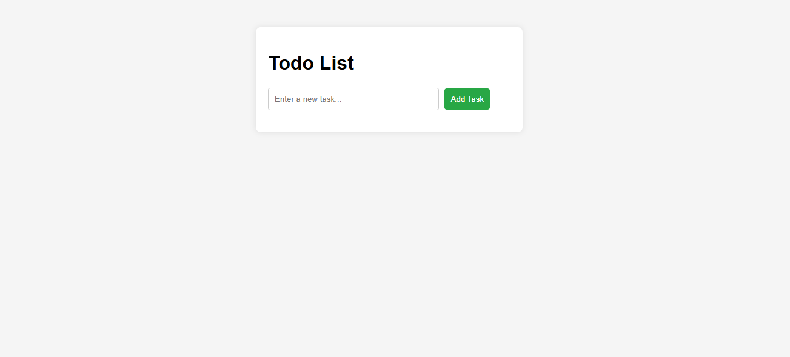
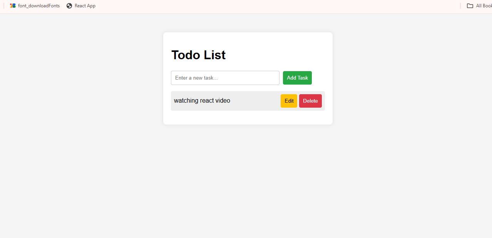
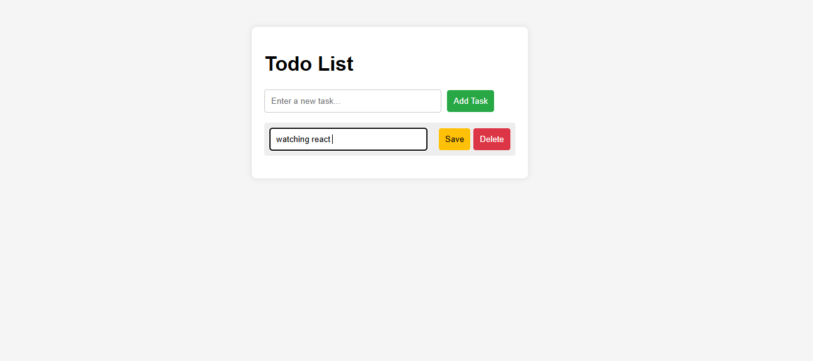
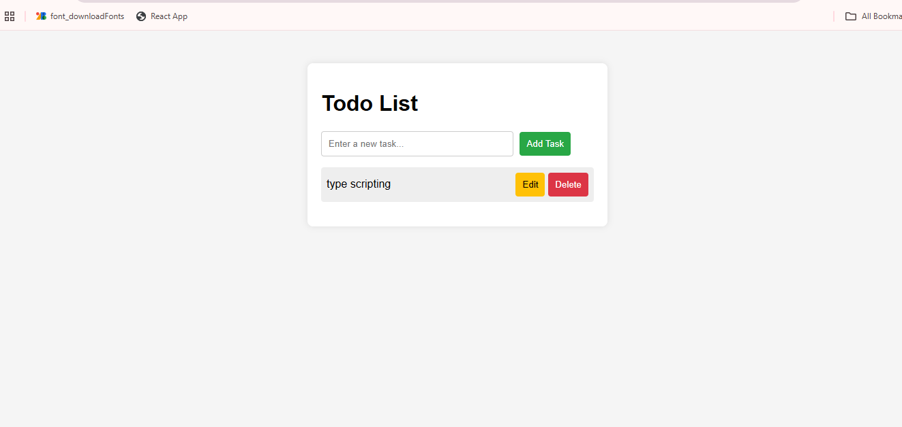

# Simple Todo List App

This is a simple Todo List web application built with HTML, CSS, and JavaScript.

## Features
✅ Add tasks 
✅ edit tasks 
✅ Delete tasks  

## How to Run
1. Download or clone the repository:
## Screenshots

### Home Page
Shows the initial page with the input and Add Task button.

### Adding a Task
Demonstrates adding a new task to the list.

### Editing a Task
Shows how you can edit an existing task.

### Deleting a Task
Displays a task after it has been removed.

